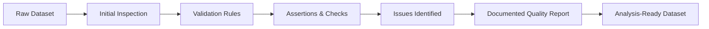

# Module 9 — Data Validation and Quality Assurance

**Session Time:** 120 minutes

---

## Prerequisites

- Python fundamentals (functions, conditionals)
- Working with Pandas DataFrames
- Basic exploratory data analysis (EDA)
- Completion of **Module 8 — APIs and Web Scraping**

---

## Session Breakdown

| Segment | Topic                                             | Duration (minutes) |
|--------:|---------------------------------------------------|--------------------|
| 1       | Introduction to Data Quality                      | 10                 |
| 2       | Common Data Quality Issues                        | 15                 |
| 3       | Data Validation with Pandas                       | 25                 |
| 4       | Assertions, Rules, and Automated Checks           | 20                 |
| 5       | Reproducible Data Quality Reporting               | 20                 |
|         | **Lab — Data Validation and Quality Assurance**   | **30**             |

---

## Learning Objectives

By the end of this module, you'll be able to:

- Apply data-quality checks and assertions to validate datasets  
- Detect and handle errors, anomalies, and inconsistencies in source data  
- Design validation rules aligned with analytical goals  
- Generate and document a reproducible data-quality report for project files  
- Communicate data-quality findings clearly and transparently  

---

## What You Will Learn

In this module, you move from **exploring data** to **trusting data**.

High-quality analysis depends on **reliable inputs**. Before performing correlation, regression, or modelling, analysts must ensure that datasets are:

- Complete  
- Consistent  
- Accurate  
- Fit for purpose  

You’ll learn how to **systematically validate datasets**, identify issues early, and document data quality decisions in a reproducible way.

---

## Introduction to Data Quality

Data quality refers to how well a dataset supports its intended analytical use.

Even datasets that “look fine” can contain issues such as:

- Missing or null values  
- Invalid ranges or impossible values  
- Duplicates  
- Inconsistent formats  
- Logical contradictions between fields  

Unchecked, these issues can lead to **misleading conclusions** and unreliable models.

---

## Common Data Quality Issues

Typical problems analysts encounter include:

- **Missing data** — incomplete records  
- **Outliers and anomalies** — extreme or unexpected values  
- **Type mismatches** — numeric values stored as strings  
- **Inconsistent categories** — e.g. `"yes"`, `"Yes"`, `"Y"`  
- **Duplicate records** — repeated rows or identifiers  

Identifying these issues early is a critical step in responsible analytics.

---

## Data Validation with Pandas

Pandas provides practical tools for validating datasets.

You can:

- Check for missing values using `isna()`  
- Validate ranges and conditions with boolean logic  
- Detect duplicates with `duplicated()`  
- Inspect distributions and value counts  

Validation is not just about cleaning — it’s about **confirming assumptions**.

---

## Assertions and Automated Checks

Assertions allow you to formalise expectations about your data.

Examples include:

- Ensuring no negative values in revenue columns  
- Confirming unique identifiers are truly unique  
- Verifying dates fall within expected ranges  

By encoding these checks in code, you can:

- Automate validation  
- Catch issues early  
- Make pipelines more robust  

Assertions turn informal assumptions into enforceable rules.

---

## Reproducible Data Quality Reporting

Data quality work should be **documented and reproducible**.

A good data-quality report explains:

- What checks were applied  
- What issues were found  
- How they were handled  
- Any remaining limitations  

Clear reporting ensures transparency and builds trust in downstream analysis.

---

## Conceptual Data Quality Workflow

---
## AI Reflection Prompt

Before starting the lab, use an AI assistant of your choice and ask:

> **“What are the most common data-quality risks in real-world datasets, and how can analysts detect them early?”**

As you review the response, reflect on the following questions:

- Which data-quality risks do you expect to encounter in this lab’s dataset?
- Which of these risks can be detected using automated checks or assertions?
- Which issues might require human judgement or contextual understanding?
- How could early detection of these risks improve the reliability of correlation or regression analysis later?

Keep these reflections in mind as you design and implement your data-validation checks in the lab.

This prompt is intended to help you approach the lab with a critical, quality-first analytical mindset.

---

## Wrap-Up Reflection

- Why is data validation essential before performing correlation or regression analysis?
- What risks arise when assumptions about data quality are implicit rather than explicitly tested?
- How does producing a documented data-quality report improve trust and reproducibility in analytics projects?

---

## Resources

- **Pandas Documentation**  
  https://pandas.pydata.org/docs/

- **Pandas User Guide — Missing Data**  
  https://pandas.pydata.org/docs/user_guide/missing_data.html

- **Great Expectations — Data Quality Concepts**  
  https://docs.greatexpectations.io/

- **Real Python — Data Validation with Pandas**  
  https://realpython.com/pandas-dataframe-validation/
